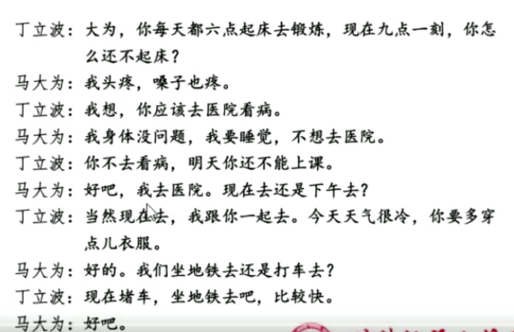

# 01选择疑问句
**课文：**

## 导入
&emsp;同学们好！明天我们班会有一个很可爱的学生要来听课，你们想不想知道他是谁呢？好，我听到很多同学说想。那我们一起猜一猜他是哪国人呢？老师听到有同学说是韩国人、也有的说是日本人。嗯他有可能是韩国人有可能是日本人，那么大家可以这样问老师呢——他是韩国人还是日本人？来一起说一遍，（重复）很好。注意这个词，“还是”（板书）。他来了我们要请他喝咖啡、茶、矿泉水，他会喜欢喝什么？你们可以怎么问老师：他喜欢喝咖啡还是喝茶？大家很聪明，老师会告诉你们，他喜欢喝咖啡。有同学说他什么时候来呀？那就可以问：他上午来还是下午来呢？非常好，他上午来。我们明天一起来期待他的到来。
##  讲解
&emsp;刚才我们一直用到了一个句子，老师写在黑板上——A还是B（呢）？当我们要在两个或多个内容中询问要选择哪一个的时候，我们就可以使用这个问句了。
  
## 练习1

&emsp;我们看看黑板上的三组图片，大家尝试用这个句式造句，向老师提问吧。第一组图片分别是学校操场和教学楼，如果你正在打电话找我，不知道我在哪里，你会怎么问我？请李明来说，哦对，老师你在操场还是在教学楼？问得非常清晰，你在操场还是在教学楼，老师会回答你，我在教学楼。就是这样，大家继续用下面两组图片向老师提问。

&emsp;杰克尔来试一下，哦你问老师：你上班是坐公交车还是坐地铁？诶很好，来大家一起说（复述）老师回答你们，我是坐地铁上班。还有一幅图片，好，麦克白问老师：你喜欢上午还是下午？老师喜欢上午。图片上是两个时钟，还有没有其他问法？我听到陈汉典问我：你的课是十点的还是三点的？非常好，你们想知道是几点上课的，就可以问（复述）。

&emsp;很好，大家还有其他问题要问老师吗？好，暂时没有啦。

## 练习2

&emsp;老师觉得，大家已经能准确地使用“还是”句来提问了，现在我们试试提问我们的同学，然后大家相互回答。黑板上有五组词语，大家可以自由选择造句。

&emsp;欧那和玛丽很快举手了，我们请他们来演示一下。哦他们选择了教室和宿舍，看看他们会怎么造句。嗯，好的。欧那问玛丽，你喜欢在教室学习还是在宿舍学习？很好，接下来请麦克来问李中文，诶，同学们听到麦克问了什么？诶对，平常你喜欢打球还是跑步？李中文中他喜欢跑步。我们一起来问班上的小帅哥马克喜欢什么样的女生呀？我们可以怎么问？诶对，你喜欢长头发的女生还是短头发的女生？

## 活动
&emsp;刚才好几组同学都相互提问了是A还是B，很多同学已经能把这个句式用到日常对话中了。现在我们可以全班来玩个猜东西的游戏啦。讲台上有好多东西，有电脑、手机、中国结、筷子、铅笔、书包。我们请五位同学来讲台上挑选一个喜欢的东西，然后不告诉大家。全班同学问他门是A还是B，直到猜中。用时间最短的，就可以带走自己喜欢的东西。

&emsp;老师来做个示范，好，我在心里想好了自己想要的东西，你们可以问老师：是电脑还是手机？都不是。是铅笔还是书包？都不是。是筷子还是中国结？啊是筷子。那么你们就猜中了。好我请奥莱多和马克等几位同学来选，大家一起来问。好啦，这个游戏结束了，那最后马克用的时间最短，老师把他喜欢的铅笔送给他。

## 作业
&emsp;我们回顾一下今天的是A 还是B句，可以用来猜测是哪一个。大家回家之后可以用今天学到的句子去问自己的爸爸妈妈。好的，下课。